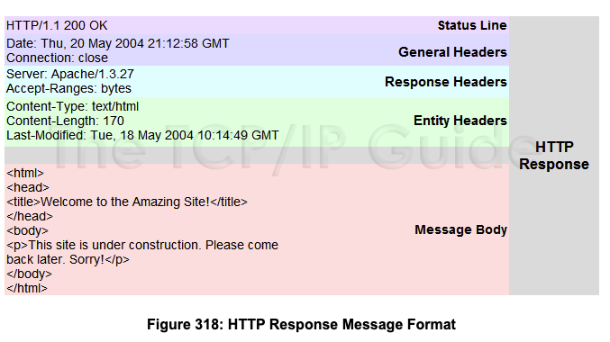

# 제 3장. HTTP 정보는 HTTP 메시지에 있다
## 3.2. 리퀘스트 메시지와 리스폰스 메시지의 구조
- 리퀘스트 메시지는 최상단에 `리퀘스트 라인` 을 갖고, 리스폰스 메시지는 최상단에 `상태 라인` 을 갖는다
```http
// 리퀘스트 메시지
GET / HTTP/1.1
...

// 리스폰스 메시지
HTTP/1.1 200 OK
```

## 3.3. 인코딩으로 전송 효율을 높이다
- 전송할 때 **인코딩(변환)을 실시함으로써 전송 효율을 높일 수 있다**
  - 다량의 액세스를 효율 좋게 처리할 수 있다

### 3.3.1 메시지 바디와 엔티티 바디의 차이
- 메시지 : HTTP 통신의 기본 단위, 옥텟(8bit) 시퀀스로 구성되고 통신을 통해 전송된다.
- 엔티티 : **리퀘스트, 리스폰스의 페이로드로 전송되는 정보**. 엔티티 헤더 필드와 엔티티 바디로 구성된다.

- HTTP 메시지 바디는 리퀘스트, 리스폰스의 엔티티 바디를 운반한다. 

    - Entity Body는 전혀 가공되지 않은 데이터만을 담고 있고, 해당 raw data의 의미를 나타내는 정보는 Entity Header에 담겨 있다. 
      - 예를 들어, Content-Type 엔터티 헤더는 Entity Body를 어떻게 해석해야 하는 지를 알려주는 정보
      - Content-Encoding 엔터티 헤더는 Entity Body가 압축되었거나 추가적인 인코인 처리가 되었는지를 알려준다.

- **기본적으로 메시지 바디와 엔티티 바디는 같지만** 전송 코딩이 적용된 경우 엔티티 바디의 내용이 변경되므로 메시지 바디와 달라진다.

### 3.3.2. 압축해서 보내는 콘텐츠 코딩
- `콘텐츠 코딩` : 엔티티에 적용하는 인코딩으로, **엔티티 정보를 유지한 채로 압축**
  - 콘텐츠 코딩된 엔티티는 수신한 클라이언트 측에서 디코딩한다